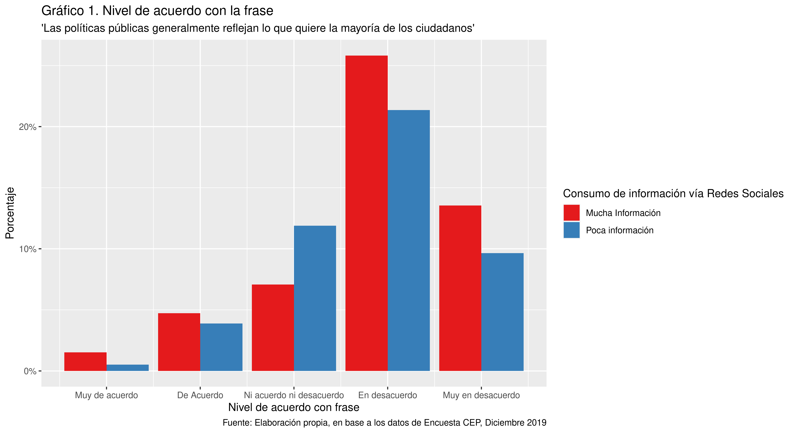
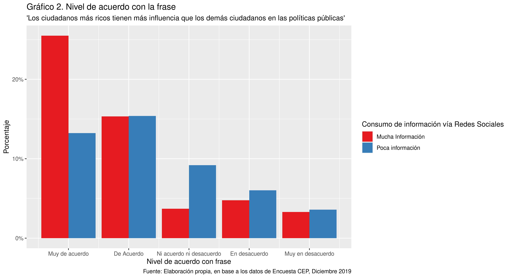
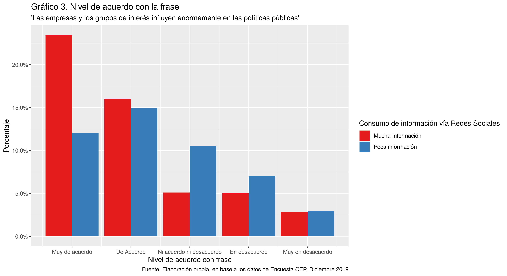

```{r setup, include=FALSE}
knitr::opts_chunk$set(echo = TRUE)
knitr::opts_knit$set(root.dir = rprojroot::find_rstudio_root_file())
```
```{r, carga-base, echo=FALSE}
tablas <- readRDS("Data/Analysis-Data/tablas.rds")
load("Data/intermediate Data/P_CEP2019.RData")
```

## Introducción
Desde las últimas dos décadas hemos presenciado una transformación importante en las formas de intercambio de opinión política, formas de asociación y de mecanismos de presión y deliberación con ayuda de internet y herramientas digitales que son parte de nuestra vida cotidiana,generando un verdadero _espacio público digitalizado_ y _una sociedad civil digital_, transformándose en un soporte fundamental para acciones colectivas en el mundo y en  particular Chile desde el año 2010 hasta la fecha, estableciendo una nueva forma inmaterial de lo que ocurre en el mundo material [@castells_redes_2012; @dahlgren_internet_2015; @millaleo_activismo_2013]. 

Sin embargo, lo que en algún momento los académicos valoraban de manera optimista como espacios de sociabilidad y deliberación emergente y prometedora de la gran "ágora electrónica global" [@castellsGalaxiaInternetReflexiones2001], pasó a ser percibido de forma más pesimista, donde las grandes empresas controlan la mayor cantidad de plataformas digitales [@dolataCollectivityPowerInternet2018], construyendo formas especiales de relación en dichas plataformas a través de algoritmos. La construcción de estos algoritmos ha sido aprovechada por distintos grupos políticos que generan _Fake news_ y posverdades [@karpfDigitalPoliticsTrump2017; @vanderlinden_you_2020; @santanaSonBotsAutomatizacion2019], convirtiendo el espacio público digital en una zona de constante asedio de información y exposición de conflictos sociales, con una polarización política creciente y sostenida. 

Probablemente el ciberactivismo ha llegado a su punto máximo en el país en el llamado "Estallido social" de Octubre del 2019. Señala Pablo Alconta en un reciente artículo: "la principal arma de confrontación entre las armas del Estado de Chile, basadas en la violencia tanto de su fuerza y sus términos jurídicos, se han encontrado las redes sociales virtuales y los equipos de telefonía móvil de las manifestantes, con lo que han intentado capturar un fragmento de la realidad y hacer frente a la violencia, una forma otra de acción política" [@alcota_insurreccion_2020, 13]. Las redes sociales se conformaron como el soporte principal para romper lógicas mediáticas que no dejaban conforme a una ciudadanía movilizada, con altos niveles de desconfianza hacia el gobierno y con una creciente conformación se nuevos sujetos sociales que compatían información, consejos para las protestas, información crítica sobre dichos en medios de comunicación de masas tradicionales y que puso en tela de juicio todo el sistema comunicacional, apuntando a las bases de las estructuras del Estado Chileno. 

Las últimas investigaciones publicadas constatan una creciente polarización por grupos en el país, desde el año 2014 hasta el 2017[@lindh_fragilidad_2019 , 116]. El ciberactivismo fue tomado por la prensa como la caja de resonancia que aumenta la polarización y el conflicto social entre las personas a partir del “Estallido social” [@pautaPolarizarseDeprimirsePeligros2019;@laterceraYoMeSali2019], al punto de ser consideradas “fascistas” y que es necesaria su regulación y control [@diariofinanciero_ascanio_], Sin embargo a pesar de que varios medios de comunicación instalaran  esta idea, no se sabe cuál es la influencia real, qué efectos trae, cuál es su intensidad y las maneras en que se gatilla, si es que ocurren. 

### Objetivos e Hipótesis 

El objetivo central de esta investigación es observar la opinión pública y la polarización política existente en la población en base a su consumo de información de plataformas digitales, llamadas "SNS" _(Social Network services)_ o también "Redes sociales". A modo de hipótesis,consideramos que:

* H1: Mientras más alto el consumo de información vía redes sociales, mayor probabilidad de tener posiciones más extremas en el espectro de opinión pública.

* H2: Mientras más consumo de información vía redes sociales las personas se vuelven menos "indecisas", tomando posición de acuerdo o desacuerdo en distintos temas.

* H3: Mientras más consumo de información vía redes sociales hay mayor apuntalamiento o acumulación de personas entorno a un grado de de acuerdo o desacuerdo frente a distintos temas, dejando formas de distribución bimodales dentro del espectro de opinión.

Presentaremos además el marco teórico que moviliza esta investigación y luego la metodología empleada.

## Marco teórico

El concepto principal anidador de todos los demás es el de Democracia participativa, con esto se señala la búsqueda de la superación de una democracia meramente representativa y comenzar a institucionalizar y considerar los mecanismos de deliberación y participación política [@mella_elementos_2012]. Una de las inspiraciones más clásicas de este concepto y sobre todo el de la deliberación es Jürgen Habermas, quien a partir de una teoría de acción comunicativa señala que existe ante todo una esfera pública construída a partir del ascenso de la burguesía, y que a partir de ese espacio público se puede conversar libremente y de manera racional lo que afecta a lo público. Sin embargo como apunta Nancy Frazer las discusiones entre iguales son bastante escasas, siendo el aparecimiento de respuestas contrapublicas, de competencia y disputa entre esferas públicas más constituídas y tradicionales una mejor forma de análisis cómo se constituye la democracia. La participación política es una parte fundamental de la mantención, profundización y legitimidad de la democracia. Y con ella nos referimos a toda gama de acciones como manifestaciones, ir a votar, participar de comicios, la militancia en un partido político o en otras organizaciones sociales.

A partir de esta concepción que enfatiza la participaciónse vuelve necesario despejar dos binomios de conceptos: La _sociedad civil_ como protagonista central de la democracia u la _ciudadanía_ como articulador entre sujetos.El concepto de sociedad civil tiene una larga data y con una discusión bastante interesante desde principios de s.XIX a la actualidad, teniendo presente en que la sociedad civil no es ni el Estado ni el mercado, sino que nace un tercer sector distinto de los otros dos y propio de la modernidad. La sociedad civil se vuelve un terreno de disputa donde la hegemonía y la contrahegemonía para buscar el consenso son sus elementos fundamentales [@cohen_sociedad_2001: 176], considerando al Estado y a la economía como dos esferas distintas de la sociedad civil, refrendando un modelo tripartito. 

Las limitaciones que tiene este modelo son al menos dos: no considera las concepciones de “sociedad civil transnacional” pues al estar pensado en un marco territorial definido no considera asociaciones como ONG’S, fundaciones, organismos internacionales que activan y tienen sus propios grupos de interés que llegan a competir, hegemonizar o agruparse con otros. Por otro lado observar la sociedad civil como conflicto no permite analizar correctamente algunas organizaciones de la sociedad civil que no se plantean como tal y son más bien prosociales y fomentan la cohesión.  Sin embargo para efectos de esta investigación la perspectiva de la sociedad civil como conflictos por la hegemonía es más que apropiada.

Por otro lado, la ciudadanía la comprendemos como una forma de articulación social de individuos en organizaciones (formales o informales) que disputan la res pública y los términos en que ella se constituye, a través de la identificación dinámica y dialéctica, en pos de una democracia radical de participación y de disputa de la hegemonía/consentimiento y el poder [@mouffe_retorno_1999, 101-102]. En la actualidad estamos en presencia de un nuevo ciudadano: el ciudadano digital,  que es un “ciudadano empoderado, informado gracias a múltiples fuentes, ya no actuando desde el deber, sino motivado por sus intereses individuales, y que gracias al Internet móvil se puede coordinar con otros para incidir en la vida social y política, de forma instantánea y sin importar las distancias geográficas” [@santana_ciudadania_2016: 108], lo que de alguna manera reconfigura lo que se entiende por "comunidades políticas", fracturándolas pero también reagrupándolas. 

Un cuarto concepto es el de opinión pública. Este se comprende como el escenario donde la sociedad civil intenta disputar el sentido común y la legitimidad del gobierno, dado que lo público es de “interés general, el bien común, y en esencia, la res pública” [@sartoriElementosTeoriaPolitica2002]. Es importante entender que la opinión pública está constantemente mediada por actores y mecanismos que buscan dominarla como la propaganda o los medios de comunicación de masas, pero que es capaz de generar sus respuestas contra públicas que los teóricos de las redes sociales digitales han podido contrahegemonizar [@castellsComunicacionPoder2009; @chadwick_hybrid_2013].

El último concepto que traemos a colación es el de polarización política. Con polarización política Con Polarización política entiendo como el “distanciamiento ideológico”, y que siguiendo a Sartori [-@sartori_partidos_2009], tienen características de tendencia ideológica centrífuga por sobre la centrípeta [-@sartori_partidos_2009 178], es decir que hay una tendencia de irse hacia los extremos de las posiciones sociales de todo el espectro ideológico más que al centro y donde  “la distancia entre ellos abarca el espectro máximo posible de opinión” [-@sartori_partidos_2009 177],  con estructuración ideológica congenita que produce distanciamiento hasta en los fundamentos principales en la que se funda su ideología [-@sartori_partidos_2009 179].

Los estudios sobre polarización política han sido bastante variados y la ciencia política mantiene una tradición bastante marcada de entenderlas como dispersión de pensamiento [@bordonaba-plouPolarizacionComoImpermeabilidad2019], sin embargo vale recordar que hay otras dos formas de observar a polarización: la llamada “polarización por grupos” que se define por la distancia de pensamiento entre personas que ya se identifican como similares, que busca constatar si “se están formando o no grupos distantes unos de otros y con preferencias incompatibles” [@dimaggio_have_1996; @lindh_fragilidad_2019]. O como el mismo Bordona-Plou propone, entender la polarización como “impermeabilidad”: “se refiere al grado en el que las poblaciones o los grupos se vuelven impermeables a las ideas, argumentos o razones de otros grupos, por ejemplo, de aquellos que tienen ideas e intereses políticos distintos. Un grupo puede polarizarse políticamente en la medida en que cada vez sea más impermeable a las ideas políticas de los grupos con ideología no afín” [@bordonaba-plouPolarizacionComoImpermeabilidad2019, 304].

La ventaja que tiene la primera visión sobre la polarización es que es bastante sencilla de establecer para estudios cuantitativos como encuestas sociales o de opinión policía, frente a una dificultad metodológica de la segunda, más accesible a experimentos que diseños muestrales grandes. Por otro lado, la debilidad de la primera definición frente a la segunda es su posible excesiva estandarización y poca sensibilidad a los matices que podrían haber entre formas de polarización, así como una posible caricaturización del abanico político/ideológico total que puede tener una población determinada.

## Metodología

Para la realización de esta investigación se utilizó la encuesta CEP del mes de Diciembre del año 2019. Esta encuesta, como señala su ficha técnica, posee un muestreo probabilístico ultietápico con un total de 1496 encuestas hechas válidamente. Utilizamos esta encuesta dado el tipo de muestreo que utiliza, su sistematicidad a través del tiempo y su accesibilidad. Se utilizará como variable independiente la exposición a información a redes sociales, la cual se crea a partir de la pregunta 30 "¿Cuánta información recibió usted de situaciones relacionadas a la crisis de comenzó en octubre 2019 a través de lo siguientes medios?". Se agrupo en una nueva categoría llamada "mucha información" quienes respondieron originalmente "Mucha" y "bastante"; por otro lado se agrupó en una segunda categoría llamada "poca información" a quienes respondieron "algo", "poca", y "nada" de información. Para la realización de todo el proceso de investigación se utilizó el lenguaje de programación R versión 4.0.2 "Taking Off Again" en un sistema operativo GNU/Linux Debian "Bulleyes" de 64 bits. 

Luego de construir nuestra raviable independiente, elegimos cinco preguntas sobre el valor que las personas asignan al sistema político chileno. Estas se dividen en tres preguntas sobre el rol de la democracia y la influencia de distintos actores en la creación de políticas públicas:

* Pregunta 5.a: "Las políticas públicas generalmente reflejan lo que quiere la mayoría de los ciudadanos"
* Pregunta 5.c: "Los ciudadanos más ricos tienen más influencia que los demás ciudadanos en las políticas pública"
* Pregunta 5.d: "Las empresas y los grupos de interés influyen enormemente en las políticas públicas"

Estas preguntas ^[No se consideró la pregunta 5.b ("Las políticas públicas generalmente reflejan lo que quiere usted" pues la pregunta considera la opinión propia sobre el reflejo de uno en el estado y no de su funcionamiento estructural)] ayudan a evaluar el funcionamiento general que tiene la democracia y observar la percepción de las personas en tanto el peso que distintos actores sociales tienen mś peso: si los ciudadanos, las empresas o las personas más ricas. 

Además de ello se decidió integrar preguntas sobre el valor de los partidos políticos en la democracia, siendo un elemento fundamental en el funcionamiento político occidental. Para ello se tomaron las siguientes preguntas del módulo especial:

* Pregunta 6.a: "Los partidos políticos reflejan las demandas de los ciudadanos"
* Pregunta 6.b: "Los partidos políticos son indispensables para la democracia"

Para el análisis de la información se realizaron tablas de contingencia para la comparación entre las categorías de "mucha información" y "poca información" en cada una de las preguntas, observando la distribución porcental de los grados de acuerdo en cada uno de los subgrupos. Sobre dicha distribución nos centraremos en los siguientes puntos:

* Nivel de respuestas "ni acuerdo ni desacuerdo" según cantidad de información consumida. Esta respuesta habla de indecisión al momento de tomar posición ^[Existen diversas discusiones sobre si el "ni acuerdo ni en desacuerdo" significa estar en una posición de consenso, de centro político o de indecisión. A nuestro parecer no podría ser una variable que indique consenso pues la variable habla sobre su decisión entre el "gran grupo" de estar de acuerdo o el del desacuerdo. Tampoco podŕia ser el centro pues la causa de esa respuesta podría ser una cuestión ideológica más extrema. En síntesis, creemos que esto es una cuestión más bien de indecisión política antes que una búsqueda de consenso o de ser una persona de centro.] y ver las variaciones entre uno u otro grupo son fundamentales.
* Nivel de "extremismo" de respuestas, observando cuánto porcentaje se acumula en ambas puntas del rango de opiniones.

Además de estas observaciones más bien descriptivas, las acompañaremos con las observaciones de Di Maggio y tomadas también por Lindh y otros investigadores sobre observar la polarización de la población a partir de la varianza y la curtosis ^[Estas serán informadas durante el mismo párrafo. para más detalle de estos valores remitirse al objeto "tablas" ubicado en la carpeta "Apéndice-Datos"] de cada una de las preguntas. 

## Resultados

Exponermos acá los principales resultados de las preguntas seleccionadas.



En el gráfico 1 podemos observar que existe, en términos generales, un nivel de desacuerdo considerable sobre la frase sondeada. Incluso si observamos de forma agrupada el consumo de información, en ambas categorias están concentradas en las respuesta "en desacuerdo" y "muy en desacuerdo", acumulando casi un 40% en el caso de quienes reciben mucha información y más de 30% en el caso de quienes consumen "poca información" vía redes sociales.

Ya de manera más desagregada, podemos observar algunas diferencias importantes: en primera instancia, la respuesta "ni acuerdo ni desacuerdo" tiene una diferencia de casi cinco puntos porcentuales, en la cual quienes consumen más información vía redes sociales se presentan más seguros de su opinión que quiens consumen una poca información vía redes sociales. El nivel de inseguridad se constata además al ser la segunda respuesta más frecuente en quienes tienen menor relación con la información en estas plataformas digitales. En este sentido la información vía SNS evidencia una mayor probabilidad de posicionamiento político.

Si observamos los elementos de varianza y curtosis también constatamos algunos elementos interesantes: El grupo de personas que tiene una alta información vía redes sociales tiene una mayor dispersión y apuntalamiento de pensamiento político _(var = 0.95, k = 0.43)_ , respecto de quienes tienen menos exposición a información por plataformas digitales _(var = 0.87, k = 0.04)_, sobre todo en el apuntalamiento de quienes revisan menos información vía redes sociales, donde observamos cerca de los 5 puntos porcentuales de diferencia entre los que consumen mucha información vía redes sociales frente a los que consumen poca información.



En el gráfico 2 observamos una tendencia bastante más radicalizada de lo que observamos en el caso anterior. independiende de las categorías analizadas, hay un claro acuerdo en creer que la gente más rica tiene más influencia que en las poíticas públicas, habiendo en ambas categorías una concentración en el "muy de acuerdo" y el "acuerdo". 

En segundo punto vemos que nuevamente el lugar de indecisión ("ni acuerdo ni desacuerdo") tiene una muy alta diferencia entre quienes consumen mucha información vía redes sociales con respecto a quienes consumen poca información por estos medios, con una diferencia de unos 6 puntos porcentuales, dejando en un muy bajo nivel el medio del espectro de opinión. 

Si embargo probablemente el dato que llama más la atención es la diferencia en quienes están muy de acuerdo con la idea de que los ricos tienen más influencia que los demás ciudadanos, habiendo una diferencia de 13 puntos porcentuales, que demuestran una mayor frecuencia entre quienes consumen mucha información vía redes sociales, respecto de quienes consumen menos información por esos medios. Si comparamos estos datos dados por la varianza y curtosis, observamos que la varianzas son prácticamente iguales _(var = 1.45, var = 1.44)_ entre los que se exponen mucho y poco a información de redes sociales, respectivamente. sin embargo las curtosis son diametralmente opuestas, mostrando una alta modalidad en quienes consumen mucha información _(k = 0.49)_ y una tendencia más hacia la bimodalidad entre quienes consumen menos información _(k = -0.51)_. 

En síntesis, las personas que consumen mucha información creen de manera más generalizada que los ricos tienen más influencia que los ciudadanos normales, respecto de quienes no se informan por estos medios. esto habla de opiniones más extremas, pero no estrictamente polarizadas en lo que implica la teoría más clásica que la define pues el más bimodal es quienes consumen menos información vía redes sociales, pero la mayor concentración de pensamiento más extremo la tienen quienes consumen más información de medios digitales.



La tercera pregunta es sobre la influencia de empresas y de grupos de interés en las políticas públicas, la cual en general hay un agrupamiento más tendiende a que la gente en efecto sí cree que estos actores sociales influyen en las políticas públicas, sin embargo en el grupo de quienes consumen menos información bajo SNS la distribución no es tan concentrada en esas dos alternativas ("Muy de acuerdo" y "de acuerdo"), sino que se distribuye en una medida no menor en "ni acuerdo ni desacuerdo" y en desacuerdo.  Profundizando sobre el segundo punto, vemos que hay en el centro de pensamiento cerca de 5 puntos porcentuales de diferencia, habiendo bastante menos inseguridad o opinión de centro de parte que tienen más consumo de redes sociales respecto de quienes consumen menos información de este tipo. 

En lo que respecta la distribución de las respuestas, quienes consumen una mayor información vía redes sociales tiene una varianza levemente mayor y una curtosis que habla de una distribución que va tendiendo a una bimodalidad acercándose al cero _(var = 1.43, k = 0.18)_, en comparación a quienes reciben poca información dentro de plataformas digitales _(var = 1.31  = k = -0.52)_ que tiene una leve menor dispersión pero con una tendencia bimodal más acentuada, no teniendo mayores _peaks_ en algunas de las opciones. Es por esta misma razón que a nivel descriptivo llama la atención que la posición extrema de estar "muy de acuerdo" sobre la influencia de empresas y grupos de interés, teniendo una diferencia de más de once puntos porcentuales de diferencia con respecto a quienes reciben poca información. 

En síntesis, vemos que hay una tendencia de dispersión y de simetría similares entre los que se exponen a mucha y a poca información, si embargo el apuntalamiento de las opiniones más extremas las tienen las personas que consumen más información de plataformas digitales, siendo menos propensos a irse al centro o a ser indecidos y tomar posiciones con tendencia centrífuga respecto de quienes no tienen estas pautas informativas.
  


En el gráfico 4 y 5 veremos la percepción de la ciudadanía con respecto a los partidos políticos y cuál el valor que la ciudadanía les otorga en el contexto democrático. 

En el caso del gráfico 4 observamos que hay una tendencia generalizada a que los ciudadanos crean que los partidos políticos no están para reflejar las demandas de los ciudadanos, habiendo una concentración importante en las categorías "en desacuerdo" y "muy en desacuerdo", independiente de la cantidad de información que consumen de plataformas digitales. 

Si observamos de manera pormenorizada según las categorías de información establecida, vemos nuevamente que hay una tendencia de parte de quienes tienen más exposición a información de redes sociales a salir del centro y/o de la zona de indecisión frente a la posición de los particdos políticos, pero comparativamente con los anteriores gráficos es considerablemente menor, habiendo una diferencia de menos de tres puntos porcentuales. 

Si observamos los datos de varianza y curtosis, vemos que las varianzas son más o menos similares (mucha info: var = 0.86; poca info = 0.90) de la cual se puede apreciar en el gráfico que tienen distribuciones bastante similares, pero la distribucion de quienes consumen más información es más cercana a ser uni modal (k = 0.81) respecto de la de quienes consumen menos información, al ser una distribución más "achatada" (k, 0.38). 

En síntesis, vemos que para este gráfico se cumplen las mismas condiciones que los tres anteriores, sin embargo las distinciones no son tan evidentes como ocurría en los otros casos, lo que sin duda habla de otro tratamiento de la visión de los partidos políticos.


Por último, el gráfico 5 habla sobre el apoyo a la idea de que los partidos políticos son indispensables a la democracia o no. Vemos que en términos generales hay una distribución bastante distinta a las anteriores, siendo en general distribuciones más amplias (mucha info = 1.28; poca info = 1.14) que si bien la media se encuentra de todas formas en la opción "en desacuerdo". Por otro lado los niveles de apuntalamiento son relativamente similares, y ambos tendientes a una bimodalidad creciente, sobre todo en quienes tienen consumen mucha informción vía plataformas digitales (mucha info: k = -0.82; poca info: k = -0.68)

Siguiendo con los elementos a observar, así como la ocurrido con los anteriores gráficos quienes reciben mucha información vía redes sociales tienen un porcentaje de "ni acuerdo ni desacuerdo" más bajo que quienes consumen poca información por dichos medios, estando en todas las otras respuestas en el caso inverso.

Otro punto que llama la atención es que quienes ven más información por redes sociales tienen una valoración más positiva de los partidos políticos para la democracia, con casi un 2.5 puntos porcentuales de diferencia, que a la larga puede no parece mucho pero indican que quienes se informan más por estas plataformas digitales parecieran no tener una aversión tan grande a los partidos políticos. las opciones para entender esto pueden ser muchas y las discutiremos en la próxima sección.

Un último elemento a descatar de este gráfico es que en las "colas" donde está el pensamiento más extremo, ambas están dominadas por quienes consumen más información proveniente de plataformas SNS. Esto es más particular de las preguntas relativas a partidos políticos, pues en lo que respecta la influencia de distintos actores sociales en el gobierno la repartición de la cola menos frecuente era muy similar entre quienes altosy bajos niveles de información por plataformas digitales, pero en estos dos casos las colas menos frecuentes también son de quienes utilizan más redes sociales.

## Discusión

En términos generales, respecto de la H1 podemos afirmar que en efecto existe una relación entre el consumo de información y posición más extrema en las opiniones, pero con un matiz en que esto ocurre en mayor medida cuando se tratan de opiniones sobre el rol de la democracia y el poder de actores sociales frente al Estado; cuando se trata del rol de partidos políticos la tendencia se mantiene pero en menor intensidad.

Nuestra segunda hipótesis (H2) también se confirma de manera bastante clara. La cantidad de información que se consume lleva a tomar posiciones más directas que quienes tienen poca exposición a ella. Existe una discusión importante si "ni de acuerdo ni desacuerdo" significa un pensamiento de centro o si es simplemente inseguridad de tomar posiciones, y en esta investigación consideramos que las variables para considerar una persona de centro son otras muy distintas, y lo que se refleja en la escala de likert en estas preguntas en particular es el grado de seguridad o inseguridad al momento de tomar posición. 

En este sentido, sí, las redes sociales ayudan con información para tomar posición para esto. El punto es bajo cuáles mecanismos son los que la gente toma más seguridad de responder si se informan vía redes sociales. ¿es porque son testigos y partícipes de dialogos racionales, abiertos, donde la deliberación racional de corte habermasiana tiene espacio en redes digitales? Lamentablemente este estudio no tiene capacidad para responder esto, pero sin duda que son diseños experimentales se puede llegar a explicaciones bastante consistentes para responder esta duda. Por lo pronto vale la pena recordar que bastante literatura ha constatado que las redes sociales provocan una homofilia política bastante alta [@boutyline_social_2017; @anagnostopoulos_viral_2014; @dehghani_purity_2016; @valera-ordaz_political_2018], lo que de una u otra forma facilita el proceso de circulación de información y por tanto la credibilidad aumenta, generando un aumento de la cohesión social en base a las creencias políticas, pero a la vez puede producir nuevas fisuras en la estructura social: "El riesgo de fragmentación en la estructura social puede asociarse con fenómenos conflictivos como la discriminación hacia minorías, o la reproducción de la desigualdad social" [@bargsted_patrones_]. En defintiva las SNS pueden significar una ayuda a intensificar y crear nuevos lazos sociales y participación política, pero si estas a la vez producen homofilia política podemos llegar a otros niveles de pérdida de deliberación entre personas diferentes y polarización entendida como impermeabilidad [@bordonaba-plouPolarizacionComoImpermeabilidad2019], es decir la incapacidad de ser convencido con argumentos que no son los propios ni vienen desde mi línea ideológia, por muy deseestructurada que sea.

Por otro lado rechazamos la H3, ya que el concepto de polarización utilizado es más bien ortodoxo y con líneas políticas bastante claras: debe haber una alta dispersión del pensamiento político, tiene que haber una simetría equivalente a 0 (es decir, equilibrada) y con una curtosis en cifras negativas para que se vuelva bimodal y no unimodal como en la mayoría de los gráficos que hemos traído a exposición [@dimaggio_have_1996, 695-697). En definitiva, no podemos hablar de polarización de la población vía redes sociales, así como lo afirmaron otros ivestigadores usando la misma encuesta pero a nivel general al menos hasta el año 2008, con una incipiente polarización en el sector de personas que habitualmente no votan [@lindh_fragilidad_2019 , 114-115], pero sí podemos hablar de pensamiento _más extremo_ que polarizado.

Es importante destacar la valoración de los partidos políticos. Esto si bien no es parte de las hipótesis a testear, un elemento no considerado en la investigación es que quienes tienen más información de internet presentan una distribución de frecuencias similar a lo que las teorías más clásicas de polarización señalan. Se ha hablado con bastante fundamentación cómo se ha gestado largos períodos de desafección política en Chile, donde el ciclo de movilizaciones fue una esperanza para una reativación ciudadana pero, a nivel agregado, persiste un aumento de desafección política [@bargsted_desafeccion_2018, 1] y si bien sobre la opinión del Estado el rechazo sigue siendo alto, departe de los partidos políticos puede haber algún cambio a nivel de esta categoría.

Esta investigación tiene algunos elementos a mejorar hacia un futuro. El primero de ellos es que, al hacer tablas de contingencia y una variable más bien "atípica" no relacionada a las típicas formas de clasificar como género, edad, educación o nivel socioeconómico, sería bueno integrarlas a medida de variable de control en las tablas de contingencia para responder más precisamente: ¿Es el consumo de redes sociales y no el género lo que aumenta la opinión más extrema? ¿Será el nivel educacional de quienes más se informan lo que imapactará de manera indirecta la tendencia centrífuga de opinión política? este tipo de cosas podrían ser confirmadas o descartadas integrando variables de control. En esa misma línea se deberían aplicar mecanismos de test de hipótsis como la chi cuadrada para ver los grados de libertad o dependencia de las variables de consumo de información y los grados de polarización. 

En última instancia, con esta investigación se abre un abanico importante de ampliaciones y profundizaciones de este estudio. Una de ellas es ampliar los marcos temporales de la investigación, aprovechando la sistematicidad de la información levantada por la encuesta CEP más allá del "Estallido social"; en una revisión por los cuestionarios, desde el año 2013 en adelante se comienza a preguntas por el consumo de información vía redes sociales, lo cual permite analizar pormenorizadamente:

* Medir cuántas personas se informan vía redes sociales con respecto a otros medios de comunicación
* Comparar históricamente los grados de polarización, pensamiento extremo y desafección política según corresponda, a través del tiempo

Por último hacer una comparativa más general, estructural y a largo tiempo si el uso de redes sociales aumenta la participación política de las personas utilizando otras preguntas de la encuesta de la CEP, como asistencia a cabildos, marchas, firma de peticiones, jornadas de discusión, de formación, etc. Con ello podemos calibrar si el cosumo de redes sociales aumenta la participación y baja la desafección política o viceversa.

## Conclusiones

La vida pública en la actualidad está entrecruzda por una serie de redes de información, influencia, interacción facilitada por las redes sociales sin ningún tipo de parangón en pasado; difersos autores lo han pensado con una revolución similar a la que produjo la creación de la imprenta [@briggs_gutenberg_2005] generando un nuevo tipo de cultura política. 

Lo cierto es que los mecanismos de conformación de opinión y las tensiones entre la influencia de ciertos medios y personas cercanas con cierta ideología con un tema que se ha instalado, y que lamentablemente en chile aún es muy incipiente más allá de honrosos avances que han dado luces de este fenómeno en Chile. Dadas las características de la gran cantidad de información política que se discute día a día no es fácil poder tomar muestras apropiadas para su estudio, pero lentamente los campos de la sociología digital, la política digital e incluso la antorpología digital van dando nuevas luces del cambio social vivido en chile. El estallido social no ha acabado sino que ha entrado el nuevas fases, y es probable que las rdes sociales nuevamente sean centrales en ese cambio.

\newpage
## **Anexos N°1: Tablas de frecuencia, Tabla cruzada y tablas de Varianza y Curtosis sobre nivel de acuerdo con frase 'Las políticas públicas generalmente reflejan lo que quiere la mayoría de los ciudadanos', según exposición a información de Redes Sociales**
```{r An1, echo=FALSE, message=FALSE, warning=FALSE, results='asis'}
descr(CEP_Electivo$PPubMayo, transpose = T, stats = c("mean", "med", "sd", "cv"),
                 weights = CEP_Electivo$POND, style = 'rmarkdown')
ctable(CEP_Electivo$Expo_RRSS, CEP_Electivo$PPubMayo, prop = "r", weights = CEP_Electivo$POND, style='rmarkdown', chisq = T)
```

\newpage

## **Anexo N°2:Tablas de frecuencia, Tabla cruzada y tablas de Varianza y Curtosis sobre nivel de acuerdo con frase 'Las políticas públicas generalmente reflejan lo que quiere la mayoría de los ciudadanos', según exposición a información de Redes Sociales** 
```{r An2, echo=FALSE, warning=FALSE, message=FALSE, results='asis'}
descr(CEP_Electivo$InflRicos, transpose = T, stats = c("mean", "med", "sd", "cv"),
                 weights = CEP_Electivo$POND, style = 'rmarkdown')
ctable(CEP_Electivo$Expo_RRSS, CEP_Electivo$InflRicos,prop = "r", weights = CEP_Electivo$POND,
                  style = 'rmarkdown', chisq = T, headings = F)
```
\newpage
## **Anexo N°3: Tablas de frecuencia, Tabla cruzada y tablas de Varianza y Curtosis sobre nivel de acuerdo con frase 'Las empresas y los grupos de interés influyen enormemente en las políticas públicas', según exposición a información de Redes Sociales** 
```{r An3, echo=FALSE, warning=FALSE, message=FALSE, results='asis'}
descr(CEP_Electivo$InflEmpre, transpose = T, stats = c("mean", "med", "sd", "cv"),
                 weights = CEP_Electivo$POND, style = 'rmarkdown')
ctable(CEP_Electivo$Expo_RRSS, CEP_Electivo$InflEmpre, prop = "r", weights = CEP_Electivo$POND,
                  style = 'rmarkdown', chisq = T, headings = F)
```

\newpage
## **Anexo N°4: Tablas de frecuencia, Tabla cruzada y tablas de Varianza y Curtosis sobre nivel de acuerdo con frase 'A Los partidos políticos reflejan las demandas de los ciudadanos', según exposición a información de Redes Sociales**

```{r An4, echo=F,warning=FALSE, message=FALSE, results='asis'}
descr(CEP_Electivo$DemanPPol, transpose = T, stats = c("mean","med","sd","cv"), weights = CEP_Electivo$POND,
                 style = 'rmarkdown')
ctable(CEP_Electivo$Expo_RRSS,CEP_Electivo$DemanPPol, prop = "r", weights = CEP_Electivo$POND, style = 'rmarkdown', chisq = T, headings = F)
```
\newpage
## **Anexo N°5: Tablas de frecuencia, Tabla cruzada y tablas de Varianza y Curtosis sobre nivel de acuerdo con frase 'Los partidos políticos son indispensables para la democracia', según exposición a información de Redes Sociales**

```{r tabP5, echo=FALSE, message=FALSE, warning=FALSE, results='asis'}
descr(CEP_Electivo$PPolIndis, transpose = T, stats = c("mean", "med", "sd", "cv"),
                 weights = CEP_Electivo$POND, style = 'rmarkdown')
ctable(CEP_Electivo$Expo_RRSS, CEP_Electivo$PPolIndis, prop = "r", weights = CEP_Electivo$POND,
                  style = 'rmarkdown', chisq = T, headings = F)
```
\newpage
## **Referencias**

```{r, echo=FALSE}
rm(list=ls())
```

